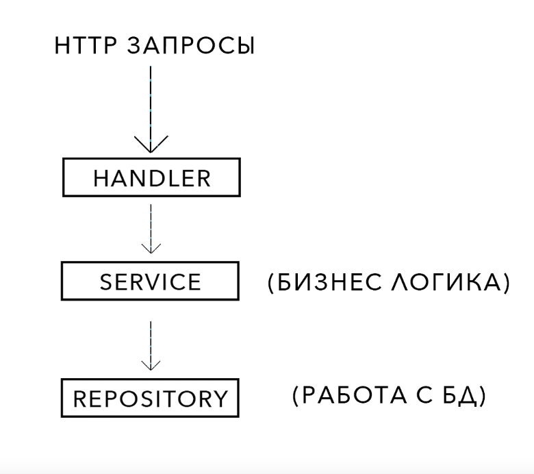
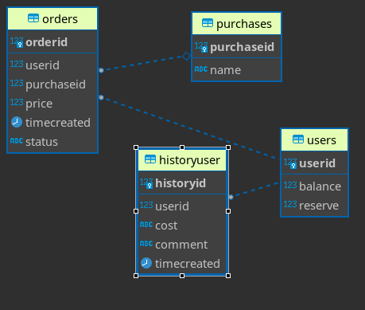

# Микросервис для работы с балансом пользователей

## Стек

* Язык разработки: Golang.
* БД: PostgreSQL
* REST API фреймворк: Gin

## Структура Проекта



## Архитектура БД

* Orders - История только покупок юзеров, без пополнения счета (Могут иметь три статуса: _waited, cancelled, approved_)
* Purchases - Наименование покупок
* HistoryUser - История только подтвержденных транзакций для всех юзеров
* User - Баланс юзера




#### Все таблицы были созданы пустыми, кроме _Purchases. Purchases_ имеет две записи.


| purchaseid | name  |
|------------|-------|
| 1          | Candy |
| 2          | Beer  |

## Запуск

```
docker-compose up
```

## Реализовано 

* Метод начисления средств на баланс. **POST /user**

* Метод получения баланса пользователя. **GET /user**

* Метод резервирования средств с основного баланса на отдельном счете. **POST /order/create**

* Метод признания выручки – списывает из резерва деньги, добавляет данные в отчет для бухгалтерии. **POST /order/decision**

* Метод получения списка транзакций с комментариями откуда и зачем были начислены/списаны средства с баланса. **GET /history**

## Примеры


* **POST /user**

Метод начисления средств на баланс. Если пользователя не было в базе, создастся новый с указанным балансом,
если пользоватеь есть, средства начилсятся на баланс. Поле _balance_ валидируется, он может быть только > 0

Пример:


```json
{
    "user_id": 111,
    "balance": 321
}
```

Возвращает: 

```json
{
    "status": "OK"
}
```


* **GET /user** 

Метод получения баланса пользователя.

Пример:


```json
{
  "user_id": 111
}
```

Возвращает:

```json
{
  "balance": 121
}
```


* **POST /order/create**

Метод резервирования средств с основного баланса на отдельном счете. Поле _price_ валидируется. Он может быть только > 0. Пример:


```json
{
  "order_id": 4,
  "user_id": 111,
  "purchase_id": 1,
  "price": 1
}
```

Возвращает:

```json
{
    "status": "OK"
}
```


* **POST /order/decision**

Метод признания выручки – списывает из резерва деньги, добавляет данные в отчет для бухгалтерии.
Проверяет по всем полям есть ли такой заказ. Поле _decision_ может быть _"cancelled"_
или _"approved"_. Поле _decision_ валидируется, то есть уже признанные покупки не могут поменять статус. Пример:


```json
{
  "order_id": 4,
  "user_id": 111,
  "purchase_id": 1,
  "decision": "cancelled",
  "price": 1
}
```

Возвращает:

```json
{
    "status": "OK"
}
```

* **GET /history**

Метод получения списка транзакций с комментариями откуда и зачем были начислены/списаны средства с баланса.
Поля _sort_type, sort_col, offset, limit_ - необязательные поля. _sort_col_ принимает значения 
_timecreated_ и _cost_.  _sort_col_ принимает значения _ASC_ и _DESC_. _sort_col_ и _offset_ > 0. _offset и 
limit_ работают как в sql.


Пример:

```json
{
  "user_id": 111,
  "sort_type": "DESC",
  "offset": 3,
  "limit": 5,
  "sort_col": "cost"
}
```
Возвращает:
```json
{
  "history": [
    {
      "cost": 10,
      "comment": "Add to balance from persona X",
      "time_created": "2022-11-10T01:27:15.891922Z"
    },
    {
      "cost": -11,
      "comment": "approve purchase Beer",
      "time_created": "2022-11-10T01:34:49.634927Z"
    }
  ]
}
```
